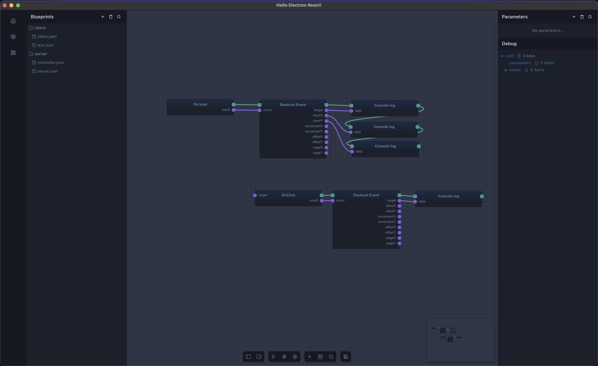

## Visual scripting 
A app built using electron and react that enables node based visual scripting 



## Development
### Install dependencies
```
yarn 
```

### Start the application
```
yarn start
```

Cloned from this repo: https://github.com/electron-react-boilerplate/electron-react-boilerplate